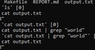

<h1 align="center">Hi 👋, I'm Brandon Hillig</h1>
<h3 align="center">A passionate Software Engineer from San Jose</h3>

  

- My Website: [brandonhillig.com](https://sites.google.com/view/brandonhillig/home)
- 📫 How to reach me **brandonhillig@gmail.com**
  
<h3 align="left">Connect with me:</h3>

<h3 align="left">Languages and Tools:</h3>

         

<h1 align="center">Projects</h1>
<table bordercolor="#66b2b2">
  
  <tr>
    <td width="50%" valign="top">
      <h3 align="center">Sorting Algorithms Visualizer</h3>
         
        
         
        

          
    
      

        
<strong>C++, SFML, ImGui</strong> - Real-time application that visualizes multiple sorting algorithms. Supports Bubble Sort, Selection Sort, and Insertion Sort.

    </td>
    <td width="50%" valign="top">
      <h3 align="center">Neon Blade Impetus</h3>
         
      
         
        

          
  
      

        
<strong>C#, Unity</strong> - An AI gone rogue, your only goal is to escape the dark digital city. Cut your way through the system's defenses, slipping past projectiles and slicing through turrets in an intense momentum-based parkour game.

    </td>
  </tr>
  
  <tr>
    <td width="50%" valign="top">
      <h3 align="center">Oops! All Bards</h3>
         
        
         
        

          
  
      

        
<strong>C#, Java, Unity</strong> - Code base for an ongoing research project concerned with game agent believability, artificial intelligence for game NPCs, and leveraging heterogeneous AI systems to open new game design spaces.

    </td>
    <td width="50%" valign="top">
      <h3 align="center">CShell</h3>
       
        
       
        

  
      

        
<strong>C</strong> - This program emulates the functionality of a shell, allowing users to run programs and commands, pipeline processes, create background jobs, and even redirect input and output.

    </td>
    
  </tr>
</table>
